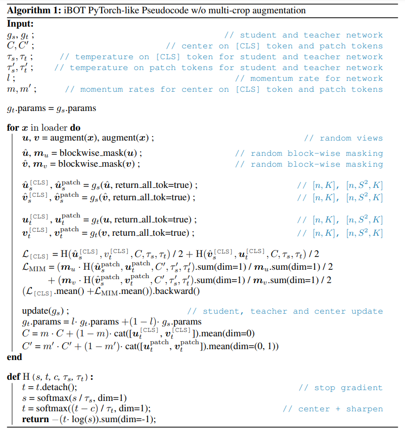
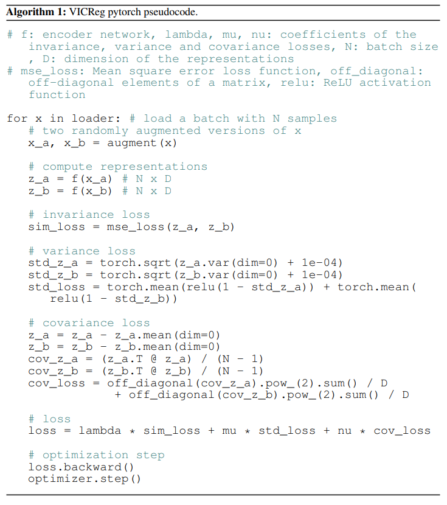

# rl_goal_idm
The goal of this repo is to explore goal condition RL with the use of transformers by conditioning on goal states.
The settings considered are assummed to provide a goal state, which the agent is supposed to reach. 
It is assumed that there exists $m:\mathcal{S} \rightarrow \mathcal{G}$, s.t. $\forall s \in \mathcal{S}, m(s) \in \mathcal{G}$, so that every state can be seen as a "goal state". This implies that there is a relation between the goal space and the state space, in the basic case we simply assume $\mathcal{S} = \mathcal{G}$ and that $m$ is the identity function. 

We want to train a transformer decoder in a causal/autoregressive way to predict the actions from state s_t towards
reaching goal state g, where g = s_t+k for k > 0. 

## Plan
- find a set of task domains
    > FetchPush (Wgcsl) \
    > GAPBlocks (sawyer block manipulation) \
    > SawyerPushing (gcsl) \
- bencmark comparisons
    > gcsl \
    > wgcsl \
- prepare one of the task domain, so that it is possible train, evaluate on these
    - fetchReach, can be used for both offline with wgcsl data and also for online
    - for online one has to benchmark with gcsl on some of their datasets claw and lunar lander, to see if implementation is as good as gcsl
        - start with lunar landar, run the gcsl on cloud(check), then dev. the transformer version and try run it also
        Developing the idm transformer for gcsl
        - develop the model with data 
        - making dynamic ahead masking
        - add required interfacing classes
        - make new replay buffer
        > Exp 1: tried to run transformer version with random goal sampling
        - did not work well on gpu, does not get higher succcess ratio throughout training
        - perhaps some bug somewhere
            - loss is going down, so classification is well, but it just seem that either the wrong actions are classified or the inference is not correct for generating actions
            - 1: check what is being predicted in inference
                - the accuracy is 0.97 when looking at buffer data 
            - 2: check targets and masking are correct
                - ...
            - 3: BUG1: in inference we have history of states s_t-k,...,s_t,s_g, and we want to generate action to do at s_t
                       to reach s_g, but here we took after gpt(X)[-1], (where X is the seq above), hence we took generated action at goal position
                       s_g, but that is not what we want. we want action for s_t, so we need to take gpt(X)[-2], in above ordering.
                - > after fixing this, it did not seem to improve 
            - 4: change goal positional encoding from max_tracejtory pos to + 1 
                - > not impactful it seems
            - 5: try using decoder, make fixed action token, have it attend on s_t and g_t only by cross attention, and see if that works
                 this will move it even closer to gcsl perhaps 
                 - > did not have any noticeable impact
            - 6: try adding false positives. false positives will make it so that it can not rely only on rememberance 
                - > seemed to add some regularization but didn't push it to generate good actions, but still minimizes loss
            - 7: remove positional encoding, as then it would not be able to remember anything but the state, and not the ordering 
                - > removed pe on small, loss goes down, but no improvement towards goal, seems the wrong actions are being learned? (8F2)
            - 8: increase layersize of gcsl to see if it can overfit in same way
                - > seems to make it much wors, only reaches 0.48 after 200k steps loss goes down on train set, but up on validation set, avg. dist. seems not improving (redo)
                - > follow up, scale the transformer approach to same number of parameters ~ 120k and see how it does there
            - 8F1: scale transformer to around 120k parameters
                - > loss goes down slowly on train set, but not so much on val, wrong actions are learned, buffer is wrong, try their buffer training method
            - 8F2: check buffer sampling, try train from there buffer
                - > buffer seems okay, 
                - > training transformer from their buffer, not working so far, need to refocus here, seems processing s_t and g seperately
                    makes it so g is redundant to get good loss on this simple task
                - > training with net like theirs worked
            - 9: increase n_accums of gcsl to 50, to see if that will make it overfit the same way as the transformer
                - > gcsl still works, but makes it slower
            - 10: modify gcsl to take full goal state
                - > gcsl still works, but learning may get a bit slower, so likely not the thing that tanks the transformer
            - 11: try and understand more what actions are genereated towards the goals, see how the trained gcsl does and compare to transformer
                - > seems to genereate actions as expected, but it simply minimizes loss, and does not ensure trajectory will be reached, so
                    it will modify its behaviour to be predictable in a way
            - 12: try and instead of training for every step to predict first action towards some future goal, sample start and end, and then 
                  train to generate all actions in between
                    - new masking,adjusted action sampling
                - > did not work either, but forgot to zeroify states beside s_t and g, perhaps that can make a diff 12F1 + add masked targets
            - 12F1: zerofiy all besides s_t and g, and try with and without pe + noisy targets
                - > not working, perhaps need to change the way actions are taken but not promising
            - 13: focus on why the simple case with s and g with transformer does not work?
               - > many changes, noise, randomization of actions, self attention only, minimizes loss, but does not reach state, cut it, focus on  online expectation based loss or just offline
        Round 2 attempts:
            - Hypothesis: using a large model to process s and g sepeartely induces the collapse problem, the model predicts the same action
                          all the time, and influences its buffer data to be such collapsed data reinforcing this cycle
            - Remedies: try using the known approaches from vision ssl particular try 1) knowledge distilling, 2) VICReg approach, besides that 
                        could try online expectation maximization of wanted state (but not efficient, and hard to see how it could be used on non-
                        expert data.)
            - observations to gather: see what actions are generated in simple s, g approach, with msa and transformer. see what actins are
                                      generated with initial idm transformer approach. This is to check whether as expected the actions collapses to single action, try with larger buffer, and the setup with smaller buffer and low batch size.
                                      - gcsl for comparison:              check 
                                      - s,g + msa + large buffer:         check 
                                      - s,g + msa + small buffer:         check
                                      - s,g + transformer + large buffer: check 
                                      - s,g + transformer + small buffer: check
                                      - idm + transformer + large buffer: 
                                      - idm + transformer + small buffer:
            - build knowledge distilling approach (ibot,dino like)
                        - build vicreg approach
            Observations:
            - when buffer is large and model is large, it seems to simply overfit to the data and learn to remember which actions were taken at any point 
                - so regularize it more? make model smaller, set up masking to only current state and goal state in lunar env, false positives?
                - restrictive masking will make it more like gcsl, and remove its remembering ability in very large sense, except for through the 
                  positional encoding information
            - when model is small, and buffer=1, it will learn to cheat by at some point predicting the same action all the time and hence influencing the buffer it receives
            - when model is small and buffer is larger, hmmm    
            
    - then after checking in online case with benchmarks on gcsl, one can move to the nicer fetch envs for online first, then offline perhaps
- setup first experiment for some of the benchmark tasks
    - write expectations and evaluation metrics for experiment
    - run experimet
    - evaluate and plan for next iteration

## Knowledge distilling (ibot, dino)

To avoid collapse, the paramters $C$ (centering) and $\tau$ (temperature) are important, IBOT sets them as in the dino paper. 
- $C = 0.9$ centering for teachers (appendix D. dino)
- $\tau_t = 0.04 -> 0.07$ temperature for teacher (appendix D. dino)
- $\tau_s = 0.1$ temperature for student (impl. details)

$C$ prevents one dimension to dominate but encourages collapse to uniform distribution. $\tau$ temperature sharpening of the softmax has the opposite effect. Applying both avoids collapse in presence of a momentum teacher.
$\tau$ in their experiments has to be initalized below $0.06$ to avoid collapse, but they scale it linearly from $0.04$ to $0.07$ during the first 30 epochs of training (unecessary step just step at $0.04$)

### Experiments
- EXP1 - default dino setup 
    - target network predicts act logits, student simply mirrors, no connection to actions, data is too simple and not sure if having no action connection is sensible 
    - tried tau_t 0.0001 (collaps to 0), 0.04 (default), 0.1, 1 (collapse toward -log(1/K)) 
    - try with expander, 
        - not working on simple 512,512,512 expander
    - get targets from teacher with dino loss
        - with expander, not workinng
        - no expander, not working
    - get targets from teacher no dino loss, ce loss
        - complex state, goal nets + merger net
            - stable (does not collapse loss wise), reaches 0.3-0.58 eval. suc. rate, first time such a net does not collapse
        - try simpler side nets + merger net
            - simpler side net, with larger merge net (300,400) matches gcsl, but is a bit faster, tmp1 data folder
        - consider msa, idm...
            - msa, with simple out, larger out, not seeming to work when taking s embedding only in outnet 
            - idm, not working 
            - msa with key value being s + g, results in tmp2 data
                - works, but only reaches subpar 0.5 eval suc. rate, 
            - vicreg perhaps?
        - dino sidnet+merger with 0.9 polyak?

- Exp2 VICREG
    - using ema teacher + vicreg 10,10,1, + no expander works, used large mixer (ma) + large out net, works a bit below default
    - not working for all setups, and not for idm
    - try idm, with lower lambda 
        - not working 10,8,5 lambda
    - try mixing s_t and g with net to generate goal post, try it for the idm approach
        - works well especially when using large idm 256 h_size
Exp3 mixed goal posts
    - try different sizes 256, 128 and 64, 32, 16,8  (2 layers) with goal post mixing
        - seems 16 2 layers works well, also 8,2l
    - try replicate 16, 2l results
    (below variants has results in vigreg_idm_variants)
    - try one layer
        - has the most negative impact on performance 
    - try removing vicreg, ema still on
        - still works a bit lower hoever
    - try removing ema teacher, no vic reg
        - similar to above, indicates that vicreg is perhaps most valuable, but need to try below and reproduce more times 
    - try removing ema teacher, with vic reg
        - not tried yet
Exp4 try removing goal merging in idm, with ema+vicreg, and try lower dim, 8, but more layers, 4 layers perhaps
    - 8 dim with layers {2,3,4,6} did not work when removing goal merging
    - 8dim,2l + try larger out nets
        - not working
    - transformer dim_forward default is 2048, should not be that large, instead -> around 4*d_model
        - adjustments not working

Exp3 try make online approach
- train idm to predict trajectory between s_t and g
  and predict reached state also s_r, and then use loss = l2(s_r, g) + l2(s_r, s_ar), where s_ar is the actually reached state, hence g is fixed and way to solve it is ensuring that the predicted reached state matches g, and ensuring the actually reached state matches g, seems the most direct way to do it online
- try with and without offline trajectory estimations as well, 
- check masking
- check model, add +1 for s_r
- make online trajectory sampling
- not working as per default

Exp4 transformer with states in sequence too, with state_loss pact like
- default not seeming to work, too small net perhaps
- but not unstable when having state loss too, loss doesn't seem to improve
- perhaps s,a for state prediction, and s,a,s, or s,g for state prediction
- adjust to dt like setup, s_0,a_0,...,s_k,a_k,s_g, where s_g = s_k+1, but will be processed with goal_emb
- add simple causal masking and simply randomly chop seq size between [10-max_len] for example
- place s_g simply at first position for example and then causal masking will be for + 1.
    -> not seeming to work well doing pact + dt like
    -> when computing act, perhaps use (s_t,g) instead of just s_t
-> Next step try use decision transformer code for the model, vima like Xgpt
- decision transformer like model with g,s0,a0,s1,a1,... in causal predicition not much helpful
- try pushing the state embeddings down 8->64->2->64
    - not working
- try adapting the act prediction head to be (s0,g)

Exp5 enc-dec with enc being act tokens and dec being s_t and g
    - reaches ~ .56, sizes 128 ma, lout, perhaps 2 ma layers?  
    - ma with 128, 2 layers of ma, simple out, seems to work well reaches 72 once and ~60 sometimes
    - use transformer to predict act seq in causal way, but take action from goal?

Exp 6 ma+ Try duplicating state vectors multiple times perhaps is easier and it will make the mixing easier

Exp 7 check why pact single does not match gcsl
    - seems difference is in extracting the goal state, try 
    - of course there is a mismatch with trained goal states, and then the extracted ones on 3 dimensions,
    - analyze which approaches worked with and without goal extraction
        - with goal extraction
            - original gcsl
        - no goal extraction
            - gcsl, but slower learning, but here there is direct mixing too
            - seems all other, msa, and idm versions which worked relied on extracted goal
            - dec_idm not work, relied on non-extraction
            - traj_idm not work, relied on non-extraction
    - adjust buffer2 to emit extract goals too, try training the pact_single with and without extracted, and the gcsl org for comparison
    - buffer2 also need to randomly set s0 and g for every sample in batch in demo
    -> using goal extraction and no goal extraction both works well when changing pact_single to gcsl, but it seems issue was that there was only 
       one random s0 index position and g position per batch
    - try experiment with single s0 and g0 index per batch randomization
        -> seems to still be working, but then why didn't it work with own index generation?
    - try old idx generation again
        -> old not good, mixed, not as stable -> 0.5 
        -> sometimes good, sometimes bad very unstable, randomizing starts and ends seems important then or at least more stable
    ->> seems it can work both with and without the goal state extraction but randomization is important, perhaps in other env there might
        be too much diff between extraction and not

To work:
Exp 2 mixing s0+g, generating first act towards g
 - No ssl with 64,128,2layer idm
    -> not working
 - try with act token embedding: s0,a_token_0,g
 - try with ssl
    -> works with complex goal merging (ssl+vicreg)
- try with act_token
    -> works well with complex merging (ssl+vicreg)
    -> really well
    -> first approach to significantly beat the baseline
- try complex net only on act token
    -> not working, also using a seperate merging net, is more powerfull, and also more flexible, when generating the goals sometimes self, and sometimes by merging a future state
Exp 1 mixing s0+g, then using traj approach to connect
    - make traj transformer for getting input s_0,s_1,s_2,s_3,...,s_k,aT_k,aT_{k+1},...,aT_{k+h},g
        where g = goal_maker(s_k,s_{k+h})
        where aT_i are action tokens computed as: aT_i = a_embd + pe_i
        the goal is to decode the trajectory of actions connecting s_k and g
    it should be able to get random start idx, random end idx, and place previous state hist up to start
    then it should place the act_tokens up to the goal state, so will always fill all 50 timesteps
    attention mask can simply be unmasked as this will anyway have the trajectory tokens masked, 
    the states after g needs to be masked too or not 
    goal is to decode the actions only
    another version could have no hist, but then need dynamic padding, and the attention mask need to make sure pad tokens are not attended to

    - trying with pre-mask setup
        -> did not work on 5 bsz, needs to be redone at full batch size
    - trying with restrictive masking, and also adding masking in act_dec 
        -> did not work, needs to be redone at full batch size
    - try modify traj extract to only extract first act, that should be exact same as best model so far
        -> 
    - benchmark best idm again
        -> with batch size 5, absolutely not working 
        -> try batch size 32(not working),64 and 128 (3 runs for each) to see if smaller batch works
        -> original setup with b_size 256, works well
        -> no vicreg (only ssl), batch size 8 not working
        -> transformer based works well, very good in beginning but fades a bit to toward the end compared with top model
           this is with goal emb mixed into act tokens
        -> transformer when not mixing goal emb into act tokens is new best in 22609, slurms: 26209,26210,26226,26227

Exp 3 decoder based approach, a_k,...,a_{k+h-1} as keys, s_k and g, with g = s_{k+h} as goal
    - checking exp with single act dec 3 runs around baseline
        -> worked well
        -> can remove pos enc, to single act_token embd like other approach, do this when adding multiple states to it
    - check single act dec when not mixing goal into it (slurm:26245,26254,26255)
        - works better than when mixing goal into it it seems
    - check single act dec when not mixing goal into it + single act token emb to see if it better matches in the early phase too
        - works fine: slurm: 26719,26720,26721
    - check with all act decoding slurm-2626[4-6]
        -> not working well, reaches 0.3, perhaps to much randomness in too large windows, one act sufficient 
        -> cut this and focus on single act dec, instead of considering increasing k over time
    - check with single act dec, but pre states up to s_k allowed, this will require masking all but pre + goal
        - check that state_masking is okay, by unmasking only s_k and s_g
            -> works fine slurm:26732,26737
        - check with current approach, pre-unmasking up to s_k and s_g
            -> worsk well, seems a bit lower than bests, slurm: 26741,26742,26743 (eval is done with only s_k and s_g)
            -> slurm: 26748, 26749, 26750 (correct eval with pre+sk+sg umasked in act also s0,....,sk,....,sg | no posEmb)
                -> works well but a bit lower than best
            -> slurm: 26754, 26755, 26756 (correct | with posEmb on s0,...s_k)
                -> works but below above without posembd it seems
        - check a gating based modulation approach  
            - FiLM like modulation, learn function f: G -> R^2d, where y_1,...\y_d are the learned feature-wise coeffecients
              and b_1,...,b_n are the learned feature-wise biases. slurm: 26832, 26833, 26834
                -> seems to work but seems below best 
            - attention + gate modulation as per used in Multimodal-TOC from amazon approach. slurm: 26837, 26838, 26839, 28347, 28348
                -> seems to work but seems between gcsl and best, one run at best too
            - as above, but norm_first=False. slurm: 26840, 26841, 26842
                -> seems between gcsl and best
        - check concatenation approach
            - slurm: 26845, 26846, 26847,
                -> around gcsl
    - other experiments
        - MM-TOC gate with exploration (sample according to logits) throughout training steps
            - slurm: 28095, 28096, 28097, 28342, 28344
                -> seems more stable 
        - singleActDec No VicReg: 
            - slurm: 28106, 28107, 28108
                -> same as with it seems 
        - singleActDec No SSL + No VicReg:
            - slurm: 28109, 28110, 28111, 28340, 28341
                -> two not so good, but one good run
    - collect data, plot and get overview of data 
        - to collect: 
            - single act dec (26719,26720,26721)
            - traj dec (2626[4-6])
            - pre (26748, 26749, 26750)
            - gate FiLM: 26832, 26833, 26834
            - gate MM-TOC: 26837, 26838, 26839 (norm_first=True)
            - gate concatenation: 26845, 26846, 26847
    - try gate MM-TOC with 0.1 explore rate
    - consider new experiments, with acts, gpt like
    - benchmark on gcsl

mimicPlay approach
first try single state approaches, then move to below transformer like with pre hists too, use paddings to enable dynamic traj length
in both can then introduce pre-s0 hist

## VICREG Approach
- needs to have covariance and variance, is a mean as a way to regularize the action predictions to avoid collapse 

Variance Invariance Covariance Regularization (VICReg)

- $y = f_\theta(x)$ are representations
- $z = h_\phi(y)$ are embeddings obtained by the expander net $h_\phi$, VICReg operates on $z$
- $Z = [z_1, \ldots, z_n]$ is a batch of embeddings  
- $z^j \in \mathcal{R^n}$ is the vector composed of each value at dimension $j$ of all vectors in $Z$ 

### Variance
$\begin{equation}v(Z) = \frac{1}{d} \sum_{j=1}^d \max(0, \gamma - S(z^j,\epsilon))\end{equation}$
$\begin{equation}S(x,\epsilon) = \sqrt{\text{Var}(x) + \epsilon}\end{equation}$
- note std is needed, just using VAR induces collapse (vicreg paper)
### Covariance

$\begin{equation}C(Z) = \frac{1}{n-1} \sum_{i=1}^{n}(z_i-\overline{z})(z_i-\overline{z})^2\end{equation}$
- where $\overline{z} = \frac{1}{n}\sum_{i=1}^n z_i$
$\begin{equation}c(Z) = \frac{1}{d} \sum_{i \neq j} \left[C(Z)\right]_{i,j}^2\end{equation}$
### Invariance
- in their case they simple use l2 distance between the embedding vectors $s(Z,Z')$
### Overall loss function
$\begin{equation}l(Z,Z') = \lambda s(Z,Z') + \mu \left[v(Z) + v(Z')\right] + \nu \left[c(Z) + c(Z')\right] \end{equation}$

- hyperparameters $\lambda, \mu, \nu$ are very important to set correct
- As per appendix D.4:
    > First, we have empirically found that using very different values for λ and µ, or taking λ = µ with ν > µ leads to unstable training. On the other hand taking λ = µ and picking ν < µ leads to stable convergence, with the exact value picked for mu having very limited influence on the final linear classification accuracy.
- in particular they find $\lambda = \mu = k$ and $\nu = 1$ with $k \in \{5,10,25\}$ to perform well (table 7 appendix D.4)

